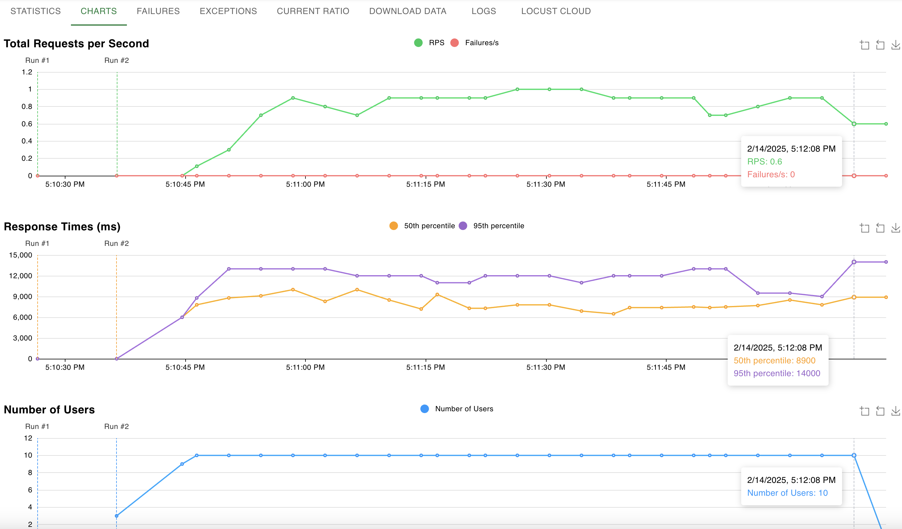
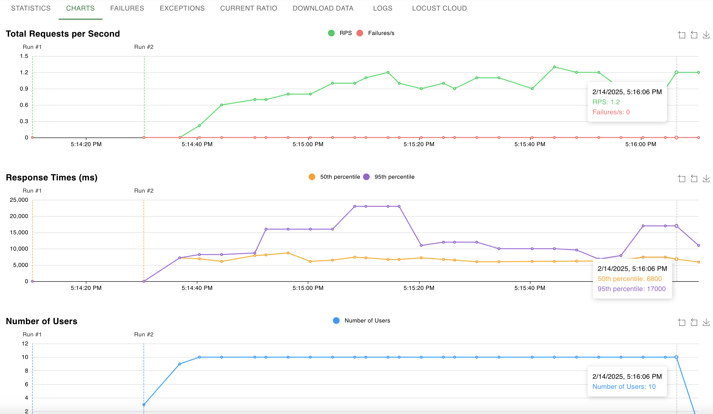

# VLM Inference Benchmarks

This directory contains benchmarks and load testing tools for VLM (Very Large Language Model) inference deployments on Modal.

## Setup Instructions

1. Download the required LLaMA models:
   ```bash
   modal run benchmarks/download_llama_models.py
   ```

2. Deploy the vllm inference servers:
   ```bash
   modal deploy benchmarks/vllm__vlm_inference.py
   ```

3. Deploy the sglang inference servers:
   ```bash
   modal deploy benchmarks/sglang_vlm_inference.py
   ```

## Testing the Servers

You can test the deployed servers using the provided client scripts:

1. Single request test:
   ```bash
   python benchmarks/vllm_client.py
   python benchmarks/sglang_client.py
   ```

2. Load testing:
   ```bash
   locust -f benchmarks/locustfile.py
   ```

### VLLM Performance Results


### SGLang Performance Results
