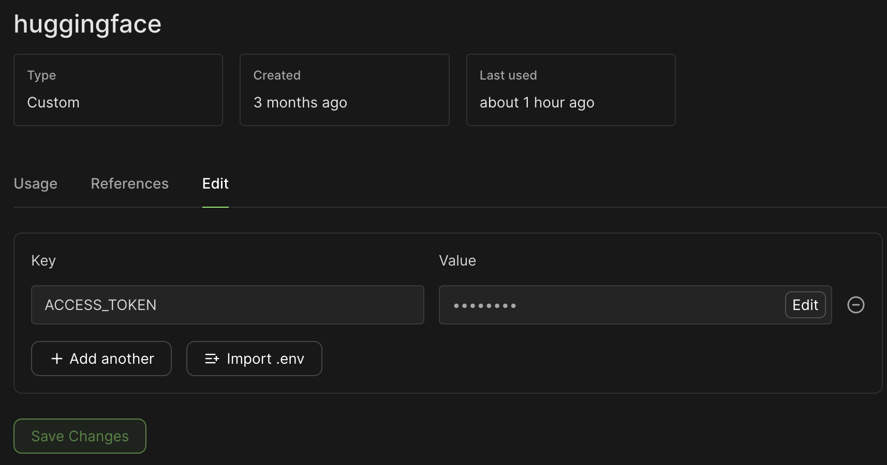
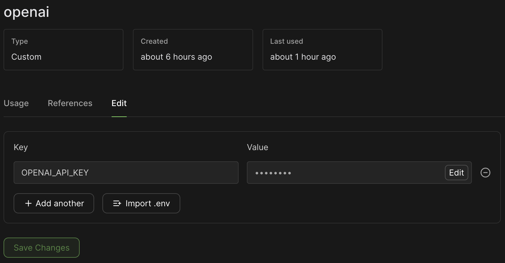
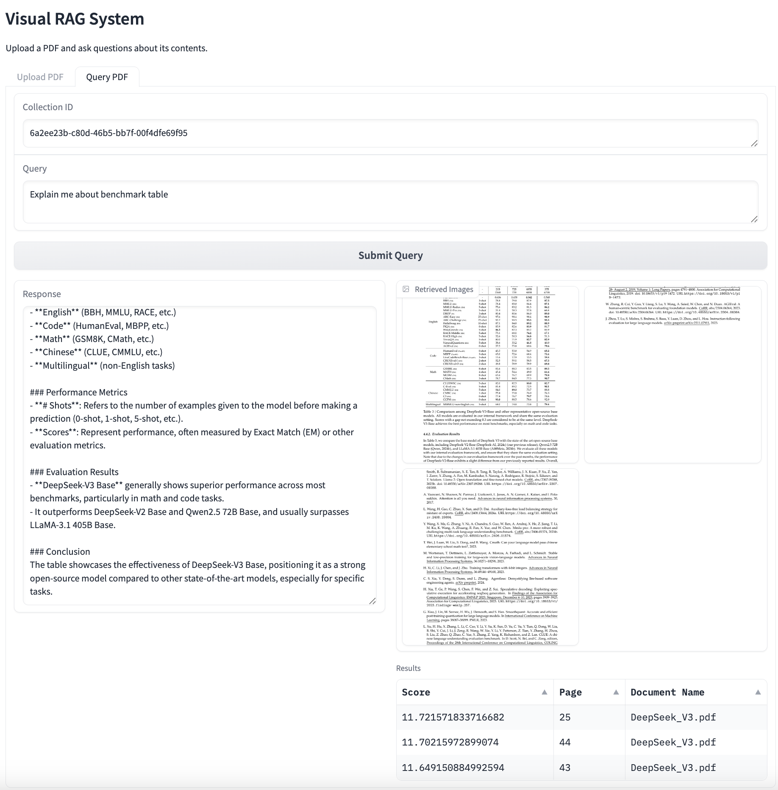

# Vision RAG

This directory contains the Vision RAG implementation.

## Setup Instructions

1. Set up Hugging Face Access Token in Modal secrets

2. Set up OpenAI API Key in Modal secrets

3. Deploy gradio app
   ```bash
   modal deploy main.py
   ```

## Example Result
